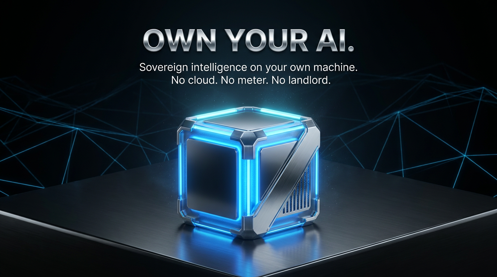

<div align="center">



# 🛰️ StratosAgent — the operating core

### The publicly-auditable core of a sovereign, local-first AI agent.

<p>


</p>
<p>


<a href="https://efficientlabs.ai"></a>
</p>

**Don't trust it — verify it. Then run it for $0.**

</div>

---

## What this repository is

This is the **publicly-auditable operating core** of StratosAgent — the part you can read, run, and
verify yourself. It is the *standard + the proof*, not the whole product:

- a **files-first operating core** — `workspace → context → trace → eval`, where the durable asset is
  plain files on disk, framework-agnostic;
- a **publicly verifiable capability-receipt** format + verifier — a PQC-signed, hash-chained proof of
  every run, checkable with the **public key only**;
- **signed-skill (SKILL.md) verify-before-run** — foreign skills are untrusted by default and
  capability-gated, deny-by-default;
- a **sovereign model router + adapter seam** — local by default, privacy pins local, cloud is opt-in
  and **never silent**.

The private **learning/economic flywheel** (how the agent compounds skills and accounts for value) and
the private connector/broker internals are **not** in this repo, by design — see
[`STATE_OF_REALITY.md`](STATE_OF_REALITY.md). What *is* here is real, and the tests prove it.

> Run `npm test` — **137 hermetic assertions across 10 suites**, no network and no LLM required. If any
> claim below breaks, a test goes red.

---

## Prove it #1 — the $0 operating loop (no API, no network)

Everything here is deterministic and local. No key, no account, no meter.

```sh
git clone https://github.com/EfficientLabs-ai/StratosAgent.git
cd StratosAgent
npm install        # one dependency: @noble/post-quantum (audited, FIPS 203/204)
npm test           # 10 hermetic suites, all green
```

Then drive the operating core end to end — capture → trace → eval — entirely on your machine:

```sh
export STRATOS_WORKSPACES_DIR=./my-workspaces

node bin/stratos.js workspace create demo
node bin/stratos.js task create demo/proj/flow/t1
node bin/stratos.js capture demo/proj/flow/t1 "how do I verify a receipt?"
node bin/stratos.js trace demo/proj/flow/t1     # writes a trace + a PQC-signed receipt
node bin/stratos.js eval  demo/proj/flow/t1     # scores it against the deterministic rubric
```

```
✓ trace written ./my-workspaces/demo/proj/flow/t1/traces/t1.json
  steps   2 · result ok
  node    did:atmos:199d0988c298…d92388
  receipt 2149c863c163 ✓ verified (public key only)
```

No model was called. No byte left your machine. The trace, the receipt, and the eval are files you own.

---

## Prove it #2 — verify a capability-receipt with a *public key only*

When models are free, the value isn't the inference — it's the **verifiable proof** of who ran what, at
what cost, without tampering. A receipt is a PQC-signed (Ed25519 + ML-DSA-65), hash-chained record. A
third party can verify it holding **only** the node's public key — no private key, no access to the
originating machine.

```sh
node bin/stratos.js receipt verify ./bundle.json
# ✓ OK — 2 receipt(s); every signature + the full hash chain verified with the public key only.
```

Tamper with a single field and it **fails closed**:

```sh
node bin/stratos.js receipt verify ./tampered.json
# ✗ BROKEN — receipt tampered (field altered) (at index 0)
```

This is the trust substrate the whole product is built on — and it's right here, open, for you to break.

---

## Prove it #3 — the cloud is never silent

The router defaults to **local**. Privacy pins local. Cloud is opt-in and always explains itself.

```sh
node bin/stratos.js route "what is 2 + 2"
# → local-fast (local / sovereign)   why: difficulty 1 → local (sovereign default)

node bin/stratos.js route "prove safety of a byzantine consensus protocol" --privacy
# → local-fast (local / sovereign)   why: privacy: stays on this machine
```

A model auto-sent by an OpenAI-compatible client never forces cloud. Cloud requires an explicit
escalation **and** your own key **and** genuine difficulty. See [`MODEL_ROUTING.md`](MODEL_ROUTING.md).

---

## Honest status — L0 → L5

We grade every claim. **L5** = verified by a hermetic test in this repo; **L0** = vision only. We never
claim above what we can measure.

| Subsystem | Level | What that means here |
|---|---|---|
| Files-first operating core (workspace/context/trace/eval) | **L5** | hermetic tests (`test-operating-core`, `test-eval-engine`, `test-icm-workspace`) |
| Capability-receipt format + public-key verifier (fail-closed) | **L5** | `test-operating-core` + `receipt verify` demo above |
| Signed-skill / SKILL.md verify-before-run (untrusted-by-default) | **L5** | `test-skill-md`, `test-skill-seal` |
| Hybrid post-quantum crypto (ML-DSA-65 + ML-KEM-768, FIPS 203/204) | **L5** | `test-skill-seal` (via audited `@noble/post-quantum`) |
| Capability gate — deny-by-default, anti path-traversal | **L5** | `test-capability-gate` |
| Sovereign router + adapter (Privacy > Capability > Cost > Fallback) | **L5** | `test-model-router`, `test-model-adapter` |
| Mesh signal — honest "false until a real fleet exists" | **L5** | `test-mesh-signal` |
| Actually *calling* a model (local Ollama / BYOK provider) | **L2** | the decision + seam are here; you provide the provider |
| Self-improvement loop | **L1** | the trace→eval→lesson **seam** is here ([`SELF_IMPROVEMENT_LOOP.md`](SELF_IMPROVEMENT_LOOP.md)); the **generator** is private |
| P2P compute mesh runtime | **L0** here | router can target it; the public node runtime lives in [The Atmosphere](https://github.com/EfficientLabs-ai/TheAtmosphere) |
| Economic / reward accounting | **L0** here | private by design — measurement before rewards |

Full detail: [`STATE_OF_REALITY.md`](STATE_OF_REALITY.md).

---

## Architecture

| Doc | What it covers |
|---|---|
| [`ARCHITECTURE.md`](ARCHITECTURE.md) | the operating-core map (what ships here, layer by layer) |
| [`CONTEXT_ROUTING.md`](CONTEXT_ROUTING.md) | how context flows: Input → Capture → Route → Store → Trace → Evaluate |
| [`MODEL_ROUTING.md`](MODEL_ROUTING.md) | the router + adapter decision tables |
| [`TRACE_SCHEMA.md`](TRACE_SCHEMA.md) | the trace record + the signed receipt spine |
| [`SELF_IMPROVEMENT_LOOP.md`](SELF_IMPROVEMENT_LOOP.md) | the public seam of the improvement loop (interface spec) |

Import the engines directly, too — the package exposes clean entrypoints:

```js
import { run } from 'stratos-agent/cli';
import { verifyBundle } from 'stratos-agent/receipt';
import { route } from 'stratos-agent/router';
```

---

## The Efficient Labs sovereign stack

| | |
|---|---|
| 🛰️ **StratosAgent** *(you are here)* | the sovereign agent's operating core |
| 🌐 **[The Atmosphere](https://github.com/EfficientLabs-ai/TheAtmosphere)** | the sovereign P2P compute mesh |
| 🔗 **[efficientlabs.ai](https://efficientlabs.ai)** | the whole story |

---

## Contributing

We welcome contributions to the public operating core — see [`CONTRIBUTING.md`](CONTRIBUTING.md). The
bar is simple: **every claim ships with a hermetic test.**

## License

**Business Source License 1.1** — source-available. Free for non-production use; converts to
**Apache 2.0** on **2030-05-29**. See [`LICENSE`](LICENSE).

<div align="center">
<sub>Built by <b><a href="https://efficientlabs.ai">Efficient Labs</a></b> — sovereign AI infrastructure.<br/>
We hold no compliance certifications we don't have, and claim no capability we can't measure.</sub>
</div>
